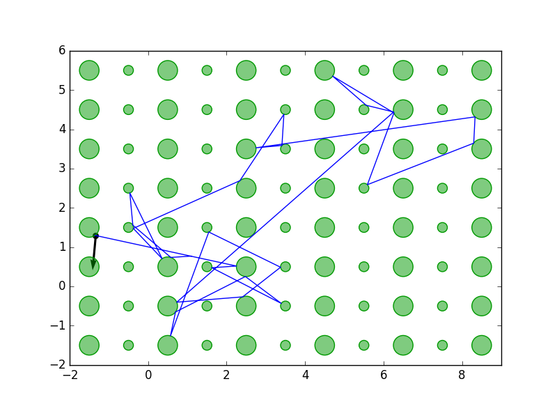

# Summary

[DynamicalBilliards.jl](http://orcid.org/0000-0002-6427-2385) is a package about
two-dimensional (dynamical) billiard systems written in its entirety in Julia. It is easy to use, and easy to
be extended. It is accompanied by a detailed documentation archive with a lot of tutorials, example code as well as information about the physical algorithms at play.

The package is mainly used to simulate any kind of 2 dimensional system where particle motion is interrupted by collisions, like e.g. a gas infused with big molecules.

# Features
The features of the DynamicalSystems.jl, as of version v1.6.1, are:

* Modular creation of a billiard table by putting together well-defined obstacles.
* Creation of random initial conditions in any user-created billiard table.
* Propagation of point particles in such billiard tables.
* Propagation of point particles in such billiard tables in magnetic fields.
* Exact calculation of the collision times, collision positions, velocities etc..
* Calculation of escape times of particles.
* Rich implementation of Ray-splitting billiards: A particle may propagate through an obstacle, given some arbitrary transmission probability.
* Calculation of Lyapunov exponents of trajectories (currently available only for propagation without magnetic fields).
* Flexible speed; users can trade between accuracy and speed.
* Extensive visualization library for plotting and animating particles and billiards.

# Description
Billiard systems have been used extensively in scientific research and played a
crucial role in the development of Chaos theory. A famous example is the Sinai billiard
(easily simulated with our package) which was one of the first low-dimensional systems proven to be ergodic [@Sinai1970].

Even though the study of billiard systems started decades ago, there are still new
surprises and plenty of research to be done with them. Bunimovich and Vela-Arevalo (two pioneers in the field) summarized new insights in the field of dynamical billiards [@Bunimovich2015].

Our package has plenty of applications, due to the large amount of features. In [@Datseris] we have used to approximate the movement of electrons in graphene, a two-dimensional material. Another application would be the motion of a particle in a gas composed of molecules much bigger than the particle, such that the collisions leave the molecules stationary. In addition, DynamicalBilliards.jl offers the first time possibility
of implementing ray-splitting billiards, since, to the best of our knowledge, there is no other open sourced project that offers this. Ray-splitting is powerful as it allows one to simulate particles that tunnel through obstacles, much like a quantum particle. At the end of this paper we provide an example application in a periodic gas-like system. Finally, one more example application would be calculating the escape time of a particle in a maze of obstacles.

The package is written in pure Julia [@Julia] a new programming language with many advantages.
Because Julia is dynamic, it allows users to experiment with billiards flexibly and interactively and have access to a very easy-to-use high level interface.
On the other hand, because Julia is as fast as C, there is no worry about the speed of the algorithms.

Another advantage of using Julia is that the source code is clear, concise and very easy to understand even for beginners. This allows our package to be extendable in an almost trivial manner. In fact, in one of our tutorial pages (https://juliadynamics.github.io/DynamicalBilliards.jl/latest/tutorials/own_obstacle/) we show users that all they need to do to define a completely new type of `Obstacle` (the things particles collide with) is only four functions, with an average of just 50 lines of code in total. Everything else is taken care of with the modular approach of our package and the power of abstraction that Julia provides.

DynamicalBilliards.jl calculates exactly all collisions between particles and obstacles, by solving 1st and 2nd order polynomial equations, which results in accuracies of the order of `1e-14` (for 64-bit floating point numbers). For this to work, particles are considered point particles. This advantage of exact solutions however also comes with a drawback: our package currently does not support (a) interactions between particles and (b) external electrostatic potentials.

We would like to bring into attention another new billiard package, called "Bill2D" [@Solanpaa2016], which is written in C instead, and supports interactions between particles. There is a some amount of overlap between DynamicalBilliards.jl and Bill2D, however both packages offer a lot of unique features not included in each other.

# Example

In the figure we show an example application of our package. A tiny particle (blue color) is propagating in
a gas of periodically located large molecules (green color). Because the mass and size of the molecules is much bigger than that of the particle, we can accept that the collisions leave the molecules unmoved.

# References
